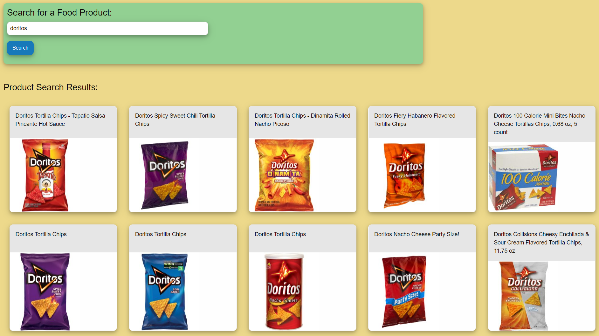
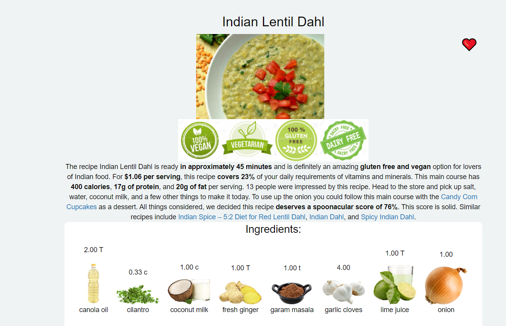

# 🥦 [Vegan Police](https://alizehssn.github.io/scaling-octo-happiness/) 🚓

 

This application was created in order to easily find consumer products that met the dietary and
allergen restrictions set by the user. Upon opening the application, there is a navigation bar at
the top of the page in order to search for makeup, food, or recipes. 
When the user clicks on their respective search criteria, they are taken to the respective
page of their request.

If the user selects “food products” from the navigation they are shown a search bar in which
they can enter a product brand. When the product is entered, the application pulls information
from [Spoonacular Api](https://spoonacular.com/food-api) and returns multiple products that match the search description.
  Upon clicking on one of the displayed images, it will retrieve the image, allergy information and ingredients for the chosen product.  

When the user selects “Recipes” from the search navigation, they are given 3 ways to search for recipes.  Search by ingredients,search by nutrients and to search randomly. When search by ingredients is picked, a simple input box is displayed with a drop down menu to select 1,5 or 10 recipes to search for.   
When the search by nutrients is selected, a varirty of nutrition inputs are displayed which allow the user to set a minimum or maximum for a given nutrient.  Above the search button there is an imput whcih allows the user to control how many recipes to search for.      The final search option is to search randomly.  There are many checkboxes to choose from ranging from vegan, main course, appetizer, beveverage and bread to name a few.  There is also a secton for the most commom intolerances which allows the user to filter out recipres that contain peanuts, gluten, dairy etc. 
   
All recipes have a ♥ next to the recipe image.  Clicking the ♥ will store the recipe and all information on the saved recipe tab.  When this tab is visited, each recipe that is saved has 3 buttons, recipe instructions, equiptment needed for the recipe and a button the remove the recipe from the saved page.  All of the information on this page will save into local storage so if the user closes the app and revisits it the next day, all their recipes will be saved! 
 

If the user selects “Makeup” from the search navigation, the user is taken to the Makeup
Investigation page.    The user can then select which dietary, allergen, or ethical criteria to find
makeup products from. The user then is shown drop-down menus with options to search by
product or brand. The user can then select between 5 and 15 results to pull. When the search
button is clicked, the application queries the Heroku-Makeup API and returns products from a
variety of brands ,or from one brand depending on the user’s criteria, that meet their needs.

